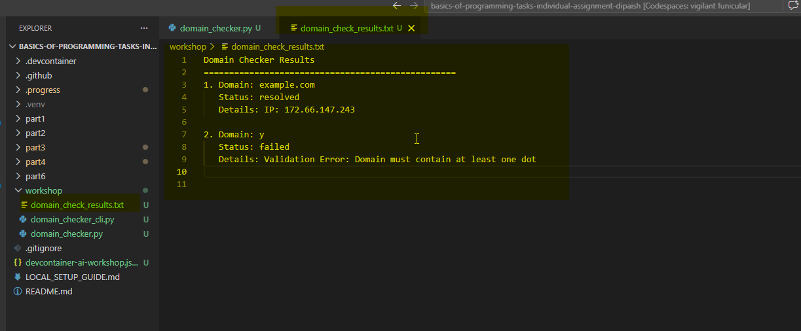
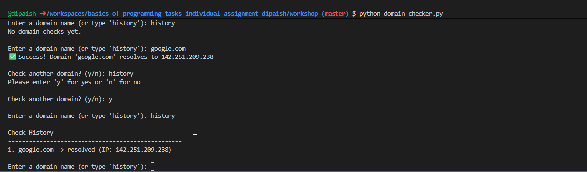
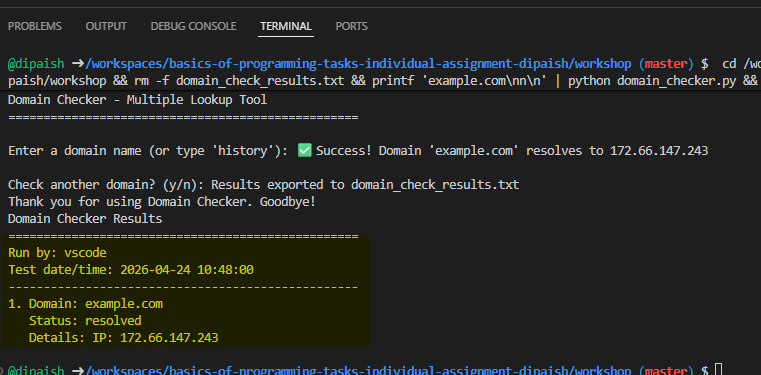

# AI-Assisted Programming Workshop Demo

## Build a Simple Cybersecurity Tool with Python

Duration: about 60 minutes   
Work mode: individual or pairs  
Prerequisite: previous programming tasks completed

## Why This Version Uses Command Line

GitHub Codespaces is excellent for Python development, but desktop GUI apps (such as PySide6 windows) may not run reliably because Codespaces does not provide a normal desktop display session.

For this reason, this demo uses a command-line application by default so every student can run it successfully in Codespaces.

## What You Will Build

You will build a command-line cybersecurity utility called Domain Reachability Checker.

The application will:

- Accept a domain name (for example, google.com)
- Perform a DNS lookup
- Show whether the domain can be resolved
- Optionally display the resolved IP address

You may use GitHub Copilot or another AI coding assistant, but you must understand and edit the generated code.

## Learning Objectives

By the end of this activity, you should be able to:

- Use AI tools responsibly in programming
- Build a small interactive Python command-line application
- Apply DNS lookup as a cybersecurity-related concept
- Improve AI-generated code through your own edits

## Prerequisites

If you are working in a local environment, make sure you have:

- Python 3.9 or newer
- Visual Studio Code
- GitHub Copilot enabled and signed in (or another AI tool)

If you are working in GitHub Codespaces, Python is already available from the dev container.

## Step 0: Create the Project File

1. Open VS Code.
2. Get to the worksShopDemo folder and create a file named domain_checker_cli.py in this folder, or create a file with the same name if it does not exist.
3. Save the file immediately.

Note: AI suggestions usually work better after the file is saved.

## Step 1: Start with a Clear AI Prompt

At the top of the file, add:

```python
# Prompt to AI:
# Create a simple Python command-line app that asks for a domain name and checks if it resolves using socket.gethostbyname
```

>> The above prompt is not the best one. It is decent. It states language, interface style (command-line), the core task (ask from a domain and resolve it) and also some technical method. 

>> Ask from the AI tool? How can this prompt be still improved? 

After the AI generates code, review it and confirm required imports are present.

If an import is missing, add it manually, for example:

```python
import socket
```

## Prompt Quality: Good vs Bad Examples

AI tools work best when your prompt is specific about context, behavior, and constraints.

Bad example (too vague):

```text
Build a domain checker app.
```

Why this is weak:

- Does not say command-line or GUI
- Does not specify validation or error handling
- Does not define expected output format

Good example (clear and task-focused):

```text
Create a Python command-line app that asks the user for a domain name,
validates empty input, checks resolution using socket.gethostbyname,
and prints either SUCCESS with the IP address or FAIL with a clear message.
Keep the code beginner-friendly and split into small functions.
```

Bad example (missing constraints):

```text
Add validation.
```

Good example (explicit constraints):

```text
Add domain validation that rejects empty input, spaces, and values without a dot.
Return a clear error message for each validation failure.
```

Bad example (unclear environment):

```text
Make it run everywhere.
```

Good example (environment-aware):

```text
Keep this as a command-line application so it runs in GitHub Codespaces.
Do not use GUI frameworks.
```

## Step 2: Generate a First Version

Your first prompt has already generated some code similar to this:

```python
import socket

# Ask user for domain name
domain = input("Enter a domain name: ").strip()

# Try to resolve the domain
try:
	ip = socket.gethostbyname(domain)
	print(f"Success! {domain} resolves to {ip}")
except socket.gaierror:
	print(f"Error: {domain} could not be resolved")
```

This is a good starting point, but it is still a one-shot script. In the next steps, improve it into a cleaner and more robust mini-application.

## Step 3: Add Input Validation

Improve the generated code so it:

- Strips leading and trailing spaces
- Rejects empty input
- Rejects obviously invalid input (for example, domains with spaces)

Suggested prompt:

```python
# Prompt to AI:
# Improve this script by adding input validation for empty values, spaces,
# and domains without a dot. Print a clear validation message and exit safely.
```

## Step 4: Add Error Handling 

The current script handles `socket.gaierror`, which is good. Improve it further so error handling is clearer and user-friendly.

Minimum behavior:

- Show success message for valid domains
- Show failure message for unresolvable or invalid domains
- Keep the app stable without crashing

Suggested prompt:

```python
# Prompt to AI:
# Improve error handling for DNS lookup and print clear messages for
# validation failures and resolution failures.
```

## Step 5: Add a Repeat Loop

The first version checks only one domain and exits. Update the app so users can check multiple domains in one run.

Example flow:

- Ask for a domain
- Print result
- Ask whether to continue (y/n)

Suggested prompt:

```python
# Prompt to AI:
# Refactor the script into a loop so users can check multiple domains.
# After each check, ask if the user wants to continue (y/n).
```

Optional improvement in this step:

- Refactor into small functions such as `is_valid_domain()`, `resolve_domain()`, and `main()`

## Step 6: Run and Test

Run:

```bash
python domain_checker_cli.py
```

Test with:

- google.com (expected success)
- invalid_domain_123 (expected fail)
- empty input (expected validation message)

Also test:

- `example.com` (expected success)
- `bad domain.com` (expected validation fail)
- An unknown domain (expected resolution fail)

**Self reflection**

- The first one-shot script generated from the initial prompt.
- How you improved it (validation, error handling, and repeat loop)?
- What parts you edited manually and why?

## Final Extension Task 

Implement one additional feature:

- Export results to a text file

- Keep a simple in-memory history of checked 
domains and outcomes 
- In the result, file include who run the test,date and time of the test 



***You may use AI support, but you must understand and adapt the output.***


## Optional Local Extension: PySide6 GUI

If you are working locally and want to build a GUI version, you may create a second file using PySide6.

Install PySide6 locally if needed:

```bash
pip install pyside6
```

PySide6 is the official Qt for Python toolkit. It lets you build desktop graphical user interfaces (GUIs) in Python, including windows, buttons, text inputs, and layouts.

PySide6 references:

- Qt for Python (PySide6) documentation: https://doc.qt.io/qtforpython-6/
- Qt for Python tutorials: https://doc.qt.io/qtforpython-6/tutorials/index.html

